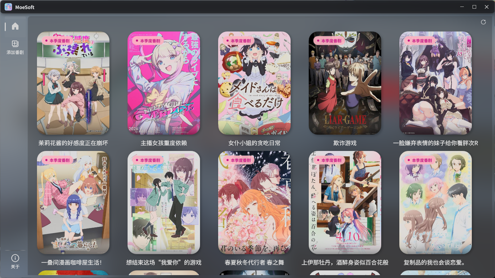
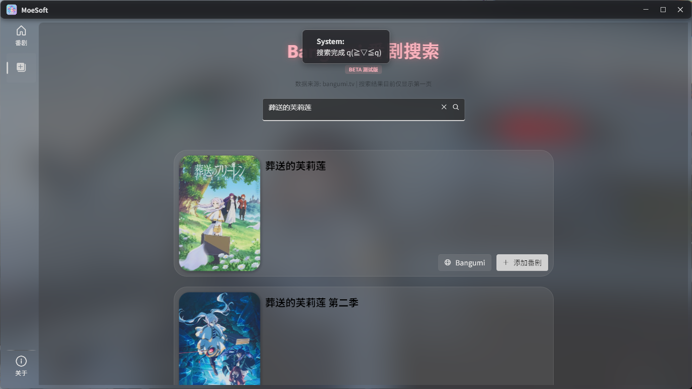
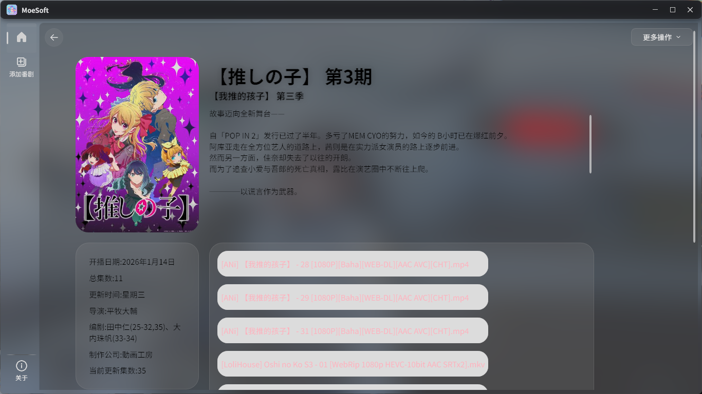

# MoeSoft

> ⚠️ **중요 안내**: 중국 본토에서는 bangumi.tv 접속이 차단되어 있으므로, 해당 지역 사용자는 VPN 등을 통해 우회하여 사용해 주시기 바랍니다.

**모던한 애니메이션 트래킹 및 관리 툴**

[English](./README_EN.md) | [日本語](./README_JP.md) | [한국어](./README_KR.md) | [中文](./README.md)

---

## 프로젝트 소개

본 프로젝트는 애니메이션 팬들에게 모던한 애니메이션 트래킹 및 관리 툴을 제공하여, 좋아하는 애니메이션을 쉽게 관리하고 추적할 수 있도록 돕는 것을 목표로 합니다.

## 🌟 프로젝트 데모 / Showcase

### 📱 홈 화면

### 🔍 기능

### 📺 애니메이션 상세 페이지

## 📦 설치 및 사용 / Installation

### 사전 요구 사항
- Windows 10/11
- .NET 8.0 Runtime

### 빠른 시작
[릴리스(release)](https://github.com/pixes2233/MoeSoft/releases)를 클릭하여 최신 버전의 설치 패키지를 다운로드할 수 있으며, 설치 후 바로 사용할 수 있습니다.

## 🤝 기여 가이드 / Contributing

Issue 및 Pull Request 제출을 언제나 환영합니다!

1. 이 저장소 Fork 하기
2. 기능 브랜치 생성하기 (`git checkout -b feature/AmazingFeature`)
3. 변경 사항 커밋하기 (`git commit -m 'Add some AmazingFeature'`)
4. 브랜치에 푸시하기 (`git push origin feature/AmazingFeature`)
5. Pull Request 열기

---

**Made with ❤️ for Anime Fans**

⭐ 이 프로젝트가 도움이 되셨다면, Star를 눌러 응원해 주세요!

---

[맨 위로 이동](#moesoft)

